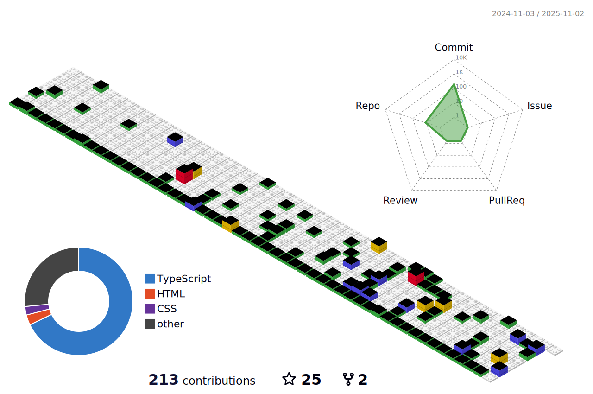

<h1 align="center">Hi 👋, I'm Uptimum</h1>
<h3 align="center">A passionate fullstack developer from Viet Nam</h3>

## About Me

    
 
        <!-- Your About Me content here -->
        - 🔭 I’m currently working on developing web, mobile, and desktop applications. 
        - 🌱 I’m currently learning new technologies in software development. 
        - 👯 I’m looking to collaborate on innovative and impactful projects. 
        - 🤔 I’m looking for help with improving my machine learning skills. 
        - 💬 Ask me about full-stack development, mobile app development, and process automation tools. 
        - 😄 Pronouns: he/him 
        - ⚡ Fun fact: I love hiking and exploring new places! 
    

    <!-- Your SVG image here -->
    <!--  -->

## What I Do

I am a full-stack developer capable of developing and deploying:

- Web applications
- Mobile applications
- Desktop applications
- Automation tools to streamline processes
- Cloud solutions for scalable and efficient applications

### Technologies and Tools

Here are some of the technologies and tools I work with:

Feel free to explore my repositories and projects, and don't hesitate to reach out if you want to collaborate or have any questions!

<!--
## GitHub Stats

&nbsp;
 -->

## Contributions

